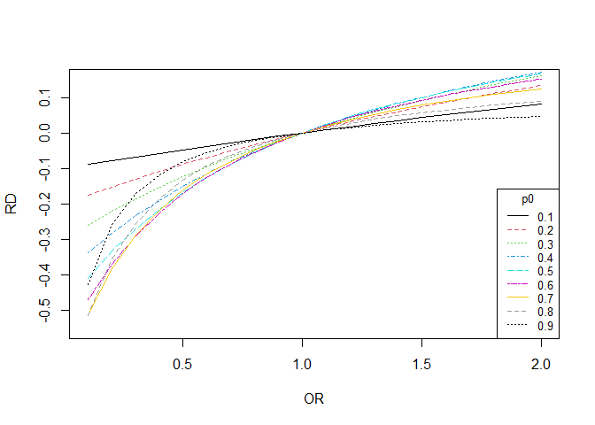
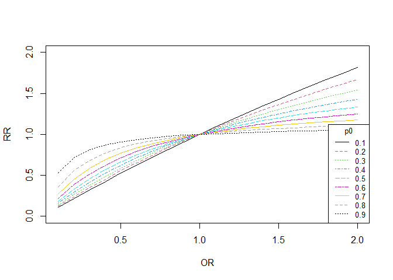

# Notations

- OR = Odds ratio
- RR = Risk ratio
- RD = Risk difference
- p0 = Background event rate (e.g., for unexposed group)
- p1 = Risk for experiencing event for exposed group
- O0 = Background odds of experiencing events
- O1 = Odds for experiencing event for exposed group

# Functions

## OR to RD

Following ref 1

```r
OR2RD <- function(OR,p0){
  O0 = p0/(1-p0)
  RD = O0*(OR-1)/( (1+OR*O0)*(1+O0) )
  return(RD)
}
```

## OR to RR

Following ref 1

```r
OR2RR <- function(OR,p0){
  O0 = p0/(1-p0)
  RD = O0*(OR-1)/( (1+OR*O0)*(1+O0) )
  RR = (RD+p0)/p0
  return(RR)
}
```

Following ref 2

```r
OR2RRx <- function(OR,p0){
  O0 = p0/(1-p0)
  O1 = OR*O0 
  p1 = O1/(1+O1) 
  RR = p1/p0
  return(RR)
}
```

Following ref 3

```r
OR2RRy <- function(OR,p0){
  RR = OR/(1 - p0 + (OR * p0))
  return(RR)
}
```

# Testing the Function

## OR to RD

### Option 1

Using derivation by a student: Liang Xu.


```r
OR = seq(0.1,2,0.1)
p0.list = seq(0.1,.9,0.1)
plot(OR,seq(-0.55,0.15,length=20), type = "n", xlab = "OR", ylab = "RD")
for (i in p0.list){
  p0 = i 
  p1 = OR * (p0/(1 - p0))/(1 + OR * (p0/(1 - p0)))
  RD = p1-p0
  lines(OR,RD, col = i*10, lty = i*10)
}
legend("bottomright", legend=p0.list, title="p0",
       col=p0.list*10, lty=p0.list*10, cex=0.8)
```

<!-- -->


### Option 2


```r
OR = seq(0.1,2,0.1)
p0.list = seq(0.1,.9,0.1)
plot(OR,seq(-0.55,0.15,length=20), type = "n", xlab = "OR", ylab = "RD")
for (i in p0.list){
  RD = OR2RD(OR = OR, p0 = i)
  lines(OR,RD, col = i*10, lty = i*10)
}
legend("bottomright", legend=p0.list, title="p0",
       col=p0.list*10, lty=p0.list*10, cex=0.8)
```

<!-- -->


## OR to RR

### Option 1


```r
OR = seq(0.1,2,0.1)
p0.list = seq(0.1,.9,0.1)
plot(OR,seq(0,2,length=20), type = "n", xlab = "OR", ylab = "RR")
for (i in p0.list){
  p0 = i
  p1 = OR * (p0/(1 - p0))/(1 + OR * (p0/(1 - p0)))
  RR = p1/p0
  lines(OR,RR, col = i*10, lty = i*10)
}
legend("bottomright", legend=p0.list, title="p0",
       col=p0.list*10, lty=p0.list*10, cex=0.8)
```

<!-- -->


### Option 2


```r
OR = seq(0.1,2,0.1)
p0.list = seq(0.1,.9,0.1)
plot(OR,seq(0,2,length=20), type = "n", xlab = "OR", ylab = "RR")
for (i in p0.list){
  RR = OR2RR(OR = OR, p0 = i)
  lines(OR,RR, col = i*10, lty = i*10)
}
legend("bottomright", legend=p0.list, title="p0",
       col=p0.list*10, lty=p0.list*10, cex=0.8)
```

<!-- -->


### Option 3


```r
OR = seq(0.1,2,0.1)
p0.list = seq(0.1,.9,0.1)
plot(OR,seq(0,2,length=20), type = "n", xlab = "OR", ylab = "RR")
for (i in p0.list){
  RR = OR2RRx(OR = OR, p0 = i)
  lines(OR,RR, col = i*10, lty = i*10)
}
legend("bottomright", legend=p0.list, title="p0",
       col=p0.list*10, lty=p0.list*10, cex=0.8)
```

<!-- -->

# Working with a data

## Titanic data

### OR


```r
url <- "http://biostat.mc.vanderbilt.edu/wiki/pub/Main/DataSets/titanic.txt"
titanic <- read.csv(file = url, stringsAsFactors = FALSE)
titanic$age[is.na(titanic$age)] <- median(titanic$age, na.rm = TRUE) 
fit.OR <- glm(survived ~ sex,
                         family = binomial("logit"), data = titanic)
est.OR = exp(coef(fit.OR))
est.OR
```

```
## (Intercept)     sexmale 
##   1.9679487   0.1019158
```

```r
require(epiDisplay)
logistic.display(fit.OR)
```

```
## 
## Logistic regression predicting survived 
##  
##                  OR(95%CI)        P(Wald's test) P(LR-test)
## sex (cont. var.) 0.1 (0.08,0.13)  < 0.001        < 0.001   
##                                                            
## Log-likelihood = -679.3609
## No. of observations = 1313
## AIC value = 1362.7217
```

### RD

- The outcome variable is `survived`
- `sex` variable is considered as the exposure variable: `Female` categoty is the reference category, and hence considered here as the background population to calculate $p0$.
- Stating values were identified by grid search (e.g., using `for` loop within plausible values)


```r
tablex <- table(titanic$sex,titanic$survived)
tablex
```

```
##         
##            0   1
##   female 156 307
##   male   708 142
```

```r
survival.rate = tablex[,"1"]/sum(tablex[,"1"])
survival.rate
```

```
##    female      male 
## 0.6837416 0.3162584
```

```r
p0 <- survival.rate[1]
p0
```

```
##    female 
## 0.6837416
```

```r
OR2RD(OR=est.OR[2],p0=p0)
```

```
##     female 
## -0.5031861
```

```r
fit.RD <- glm(survived ~ sex, start = c(.1,-.01),
                         family = binomial("identity"), data = titanic)
fit.RD
```

```
## 
## Call:  glm(formula = survived ~ sex, family = binomial("identity"), 
##     data = titanic, start = c(0.1, -0.01))
## 
## Coefficients:
## (Intercept)      sexmale  
##      0.6631      -0.4960  
## 
## Degrees of Freedom: 1312 Total (i.e. Null);  1311 Residual
## Null Deviance:	    1687 
## Residual Deviance: 1359 	AIC: 1363
```

### RR


```r
OR2RR(OR=est.OR[2],p0=p0)
```

```
##    female 
## 0.2640699
```

```r
OR2RRx(OR=est.OR[2],p0=p0)
```

```
##   sexmale 
## 0.2640699
```

```r
OR2RRy(OR=est.OR[2],p0=p0)
```

```
##   sexmale 
## 0.2640699
```

```r
require(sjstats)
or_to_rr(or=est.OR, p0=p0)
```

```
## (Intercept)     sexmale 
##   1.1842080   0.2640699
```

- Stating values were identified by grid search (e.g., using `for` loop within plausible values)


```r
fit.RR <- glm(survived ~ sex, start=c(-1,.5),
                         family = binomial("log"), data = titanic)
fit.RR
```

```
## 
## Call:  glm(formula = survived ~ sex, family = binomial("log"), data = titanic, 
##     start = c(-1, 0.5))
## 
## Coefficients:
## (Intercept)      sexmale  
##     -0.4109      -1.3785  
## 
## Degrees of Freedom: 1312 Total (i.e. Null);  1311 Residual
## Null Deviance:	    1687 
## Residual Deviance: 1359 	AIC: 1363
```

```r
exp(coef(fit.RR))
```

```
## (Intercept)     sexmale 
##   0.6630670   0.2519486
```

# References

1. [Popham, F. (2016). Converting between marginal effect measures from binomial models. International journal of epidemiology, 45(2), 590-591.](https://academic.oup.com/ije/article/45/2/590/2572549)
2. [StatsToDo : Odd and Risk Interconversion Explained](https://www.statstodo.com/OddRiskConversion_Exp.php)
3. [Get relative risks estimates from logistic regressions or odds ratio values](https://strengejacke.github.io/sjstats/reference/odds_to_rr.html)
